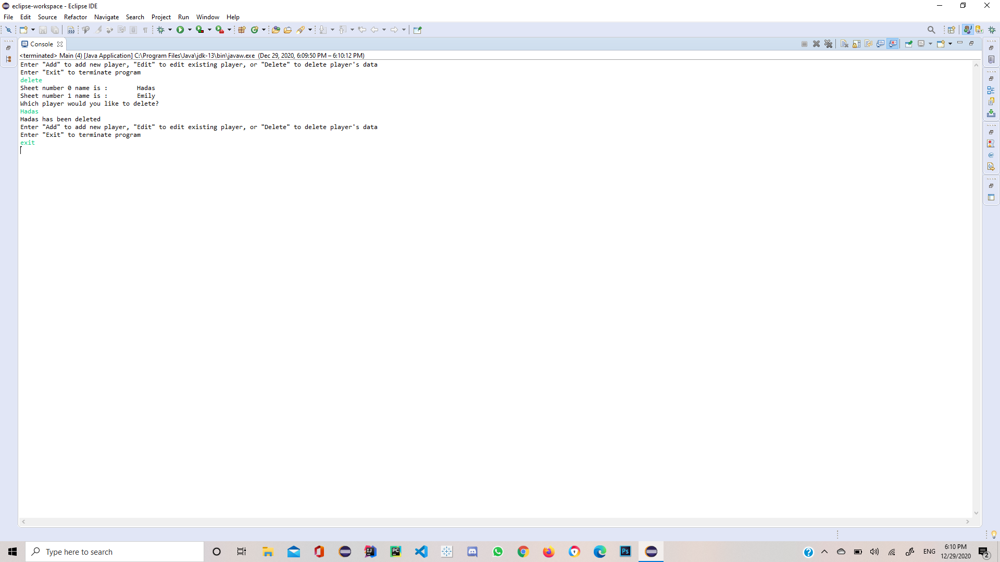

# know-your-distance
This program is used to calculate accumulated distances (averages) for different golf clubs for different players throughout a golf season. It was implemented using Java.

It allows golf coaches to enter distance data for each player after every playing round that returns the accumulated averages for the individual clubs for the respective
player.
On initial use, the program creates an excel file that allows the user to create a tab for each player where the data is stored and saved after each use.
User can also add or delete player’s data at any time.

Inspired by my work as an Assistant Coach where I noticed most players overestimate their distance capabilities. 

### Usage:
* In Main class line 10 - user to needs change destination path for the excel file and can also change file name

## Example

#### Initial Run

#### Hadas added

#### Second Run - Emily Added

#### Hadas sheet deleted

